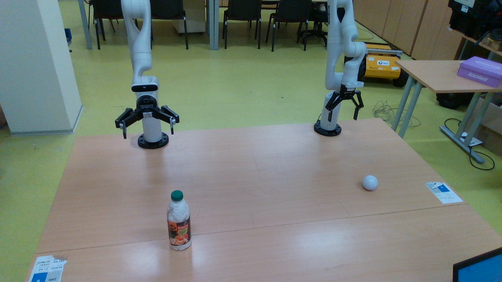
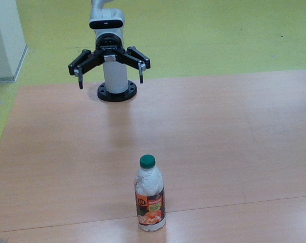

# Dataset Preparation

This document explains how the Kinova demonstrations are organized, converted into TFDS/RLDS format, and standardized for Octo finetuning.

The dataset pipeline follows this flow:

```text
Raw Kinova demonstrations
→ TFDS/RLDS dataset builder
→ Octo-compatible standardization
→ Hybrid Octo + BCE gripper finetuning
```

---

## Raw Demonstration Format

The raw demonstrations are expected to be organized as episode folders. Each episode contains:

- an `episode.csv` file with robot state/action metadata;
- an `rgb/` folder containing the corresponding RGB frames.

Expected structure:

```text
<data_dir>/downloads/manual/kinova_dataset_2/episodes/
  episode_000/
    episode.csv
    rgb/
      000000.png
      000001.png
      000002.png
      ...
  episode_001/
    episode.csv
    rgb/
      000000.png
      000001.png
      000002.png
      ...
```

The `data_dir` should be the same directory used by TensorFlow Datasets during `tfds build`.

Example:

```text
/home/<user>/tensorflow_datasets/downloads/manual/kinova_dataset_2/episodes/
```

---

## Expected CSV Fields

Each `episode.csv` should contain one row per timestep. The dataset builder reads RGB frame filenames, robot pose/state values, action deltas, gripper state, and termination information.

The builder expects image filenames through:

```text
img_file
```

The image file is resolved relative to the episode's `rgb/` folder.

The state fields include:

```text
tool_pose_x
tool_pose_y
tool_pose_z
tool_pose_theta_x
tool_pose_theta_y
tool_pose_theta_z
cmd_tool_pose_x
cmd_tool_pose_y
cmd_tool_pose_z
cmd_tool_pose_theta_x
cmd_tool_pose_theta_y
cmd_tool_pose_theta_z
```

The action fields include:

```text
a_dx
a_dy
a_dz
a_dtheta_x
a_dtheta_y
a_dtheta_z
gripper_state_bin
```

The dataset builder creates an 8-D action vector:

```text
[dx, dy, dz, dtheta_x, dtheta_y, dtheta_z, gripper_state_bin, terminate]
```

For Octo finetuning, the standardization function strips this to the first 7 dimensions:

```text
[dx, dy, dz, dtheta_x, dtheta_y, dtheta_z, gripper_state_bin]
```

The final `terminate` bit is used for terminal-step bookkeeping.

---

## Builder Configurations

The TFDS builder provides two configurations:

```text
default
radians
```

### `default`

Use this when angular pose/action values are recorded in degrees.

The builder converts:

```text
tool_pose_theta_*
cmd_tool_pose_theta_*
a_dtheta_*
```

from degrees to radians.

### `radians`

Use this when angular pose/action values are already recorded in radians.

No angular conversion is applied.

---

## Building the TFDS/RLDS Dataset

From the repository root, run:

```bash
tfds build scripts/dataset/kinova_dataset \
  --overwrite \
  --data_dir /path/to/tensorflow_datasets \
  --beam_pipeline_options="direct_running_mode=multi_threading,direct_num_workers=10"
```

Example:

```bash
tfds build scripts/dataset/kinova_dataset \
  --overwrite \
  --data_dir /home/<user>/tensorflow_datasets \
  --beam_pipeline_options="direct_running_mode=multi_threading,direct_num_workers=10"
```

After building, the generated dataset will be stored under:

```text
/path/to/tensorflow_datasets/kinova_dataset/default/0.1.5/
```

or:

```text
/path/to/tensorflow_datasets/kinova_dataset/radians/0.1.5/
```

depending on the selected config.

Generated TFDS files should not be committed to GitHub.

---

## Train/Validation Split

The builder creates a seeded episode-level split.

Current default behavior:

```text
90% train
10% val
split_seed = 42
```

The split is performed at the episode level so that frames from the same demonstration are not split across train and validation.

The builder also writes split lists into the manual download directory:

```text
train_episodes.txt
val_episodes.txt
```

These files make it easier to inspect which raw episodes were assigned to each split.

---

## Validate a Built Dataset

After building the dataset, validate one episode:

```bash
python scripts/dataset/validate_one_episode.py \
  --data_dir /path/to/tensorflow_datasets \
  --config default \
  --split train
```

This script checks:

- episode metadata;
- number of steps;
- `is_first`, `is_last`, and `is_terminal` flags;
- action value ranges;
- RGB image shape and dtype;
- terminate flag values.

Expected image format:

```text
uint8 image with shape [H, W, 3]
```

---

## Print Train/Validation Episodes

To inspect the episode split:

```bash
python scripts/dataset/print_episode_dir.py
```

If needed, update the `data_dir` variable inside the script to match your local TFDS directory.

---

## Octo Standardization Function

The TFDS/RLDS builder creates a dataset in a Kinova-specific RLDS format.

For Octo finetuning, the dataset is standardized using:

```python
kinova_rlds_to_octo
```

The standardization function is stored in:

```text
scripts/dataset/kinova_standardize_octo.py
```

The training and evaluation scripts currently expect it to be importable from the Octo package path:

```python
from octo.data.kinova_standardize_octo import kinova_rlds_to_octo
```

Copy it into your local Octo source tree:

```bash
cp scripts/dataset/kinova_standardize_octo.py /path/to/octo/octo/data/kinova_standardize_octo.py
```

The standardization function performs the following:

- reads the RLDS `steps`;
- maps `observation["image"]` to `image_primary`;
- creates hindsight goal images (as reported in octo paper, they used hindsight goal relabeling);
- converts 8-D actions to 7-D actions when needed;
- exposes `task_completed`;
- returns an Octo-compatible observation/action dictionary.

---

## Goal Image Relabeling

The standardization function uses hindsight goal relabeling.

For each timestep `t`, it samples a future frame from the same trajectory and uses that frame as the goal image. This creates goal-conditioned training examples without needing manually specified goal images.

At training time, the goal image is passed to Octo as task conditioning:

```python
task["image_primary"]
```

The model observation uses:

```python
observation["image_primary"]
```

This matches the goal-image conditioning setup used by the hybrid finetuning script.

---

## Camera View and Cropping

The raw Kinova demonstrations were collected using an external Intel RealSense RGB camera. The original camera frame captured a wide workspace view, including the table, the Kinova arm, background objects, and other robots in the lab.

However, the policy was trained on cropped images. Each episode was cropped so that the model input focused on the active robot workspace and target object. This reduces irrelevant background variation and makes the visual input more consistent across demonstrations.

This is important because the inference-time image should look similar to the images seen during training. If the model is trained on cropped images but receives a full uncropped camera frame during live deployment, the input distribution changes substantially. This can hurt spatial accuracy, object localization, and grasp timing.

For this reason, the deployment script includes a startup crop review mode:

```bash
--startup_crop_review
```

This opens a visual crop review window before live inference starts. The user can inspect the full camera frame, confirm or reselect the crop, and preview the exact 256×256 image that will be passed to the model.

The deployment crop can be saved and reused with:

```bash
--crop_json_path configs/deployment_crop.json
```

Goal images can also be cropped with a matching crop using:

```bash
--goal_crop_json_path configs/goal_crop.json
```

In practice, the live inference crop should resemble the cropped training images as closely as possible.

---

## Example Camera Views

Raw camera frame during data collection:

```text
assets/images/raw_camera_view.png
```

Cropped image used for training/inference:

```text
assets/images/cropped_training_view.png
```

## Example Camera Views

View sample raw and cropped images below.

**Raw camera view during data collection**



**Cropped image used for training and inference**



---

## Dataset Builder Acknowledgement

The Kinova TFDS/RLDS dataset builder in this repository is adapted from Karl Pertsch's [RLDS Dataset Builder](https://github.com/kpertsch/rlds_dataset_builder/tree/main), an example workflow for converting custom robot datasets into RLDS format for X-embodiment-style training.
